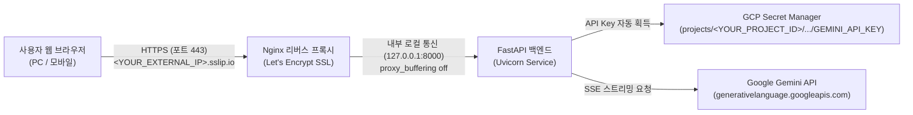
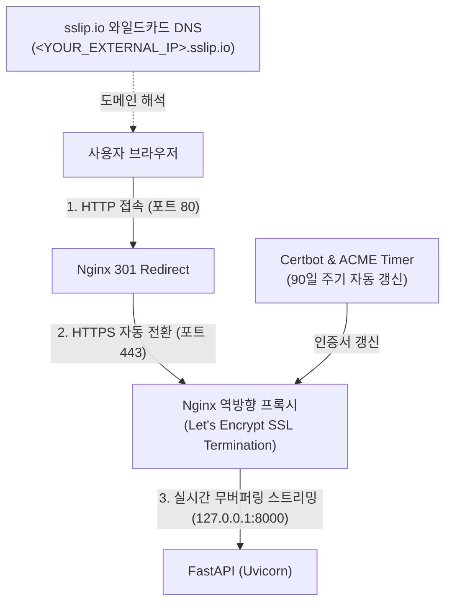

# Google Gemini 3.8 / 3.7 Flash 웹 챗봇 서비스

Google Gemini 공식 웹([gemini.google.com/app](https://gemini.google.com/app?hl=ko))의 깔끔하고 미려한 디자인("언제든지 시작하세요", 부드러운 스카이블루 그라디언트, 플로팅 캡슐 프롬프트 바)을 충실히 재현한 웹 기반 AI 챗봇 서비스입니다.
   
로컬 PC 개발 환경뿐만 아니라 **Google Cloud Platform (GCP) Compute Engine**에 완전히 프로비저닝되어 있으며, **GCP Secret Manager** 및 **Let's Encrypt 정식 SSL(HTTPS)** 암호화가 적용되어 실제 프로덕션 수준으로 운영되고 있습니다.

---

## 🌟 주요 기능 및 특징

1. **공식 Gemini 스타일 UI/UX 구현**:
   - 몽환적이고 부드러운 스카이블루 배경과 타이포그래피.
   - 중앙 환영 문구: **"언제든지 시작하세요"**.
   - 마이크 음성인식, AI 모델 변경, 프롬프트 전송이 통합된 화이트 캡슐형 플로팅 입력바.
   - 대화 시작 시 부드러운 애니메이션 전환 및 하단 고정 입력창.
2. **Google 실시간 웹 검색 (Search Grounding) 지원**:
   - Google 공식 실시간 웹 검색 연동(`googleSearch`).
   - 최신 뉴스, 실시간 날씨, 최신 정보 등을 정확하게 검색하여 답변에 반영.
   - 프롬프트 바 우측 **웹 검색 토글 버튼(`travel_explore`)**으로 즉시 On/Off 전환 가능.
   - 답변 생성 시 활용된 **검색 쿼리 배지** 및 클릭 가능한 **참고 출처(URL) 카드** 제공.
3. **다중 AI 모델 전환 지원**:
   - **Gemini 3.8 Flash (기본값)**: 강력하고 빠른 최신 세대 플래시 추론 모델.
   - **Gemini 3.7 Flash**: 검증된 고성능 및 안정적인 대화 모델.
   - 입력창 우측 알약(Pill) 또는 상단 헤더에서 원클릭으로 전환 가능.
4. **실시간 SSE (Server-Sent Events) 스트리밍**:
   - Google Generative Language API와 연동하여 타자 치듯 빠른 실시간 답변 출력.
5. **리치 콘텐츠 렌더링 & 음성 인식**:
   - 마크다운(테이블, 리스트, 볼드, 링크) 및 소스코드 문법 강조(Syntax Highlighting) + 원클릭 복사 버튼.
   - Web Speech API 기반 마이크 입력을 통해 한국어/영어 음성 질문 지원.
6. **Stateless(상태 비저장) & 로컬 보안**:
   - 서버에는 사용자의 대화 기록이 저장되지 않으며, 접속자의 **웹 브라우저(`localStorage`)**에만 개별 저장되므로 개인정보 보호에 안전합니다.

---

## 🏗️ 아키텍처 개요



---

## 🔒 HTTP vs HTTPS 전환 및 보안 아키텍처

본 서비스는 초기 배포 시 HTTP(포트 80 및 8000)로 구동되었으나, 이후 Let's Encrypt 및 Nginx 역방향 프록시를 도입하여 **HTTPS(포트 443) 보안 암호화 통신**으로 전면 전환되었습니다.

### 1. HTTP와 HTTPS 프로토콜의 핵심 차이점

| 비교 항목 | HTTP (HyperText Transfer Protocol) | HTTPS (HTTP over SSL/TLS) |
| :--- | :--- | :--- |
| **기본 포트** | `TCP 80` (또는 개발용 8000) | `TCP 443` |
| **암호화 여부** | **평문(Plaintext) 전송** (암호화 없음) | **SSL/TLS 대칭키+비대칭키 혼합 암호화** |
| **보안 취약점** | 중간자 공격(MITM), 패킷 스니핑, 데이터 도청에 무방비 | 데이터가 전송 중에 가로채어져도 복호화 불가 |
| **데이터 무결성** | 전송 중 데이터가 위조/변조되어도 감지 불가 | 메시지 인증 코드(MAC)를 통해 위·변조 즉시 감지 및 차단 |
| **서버 인증(신뢰성)** | 접속한 서버가 실제 유효한 서버인지 확인 불가 | 공인 CA(인증기관) 인증서를 통해 신뢰할 수 있는 서버임을 보증 |
| **브라우저 UI** | `⚠ 주의 요함 (Not Secure)` 경고 문구 노출 | `🔒 연결이 안전함` 보안 자물쇠 아이콘 정상 노출 |
| **웹 API 지원** | Web Speech API(마이크 음성입력) 등 최신 보안 API 제한 | 모든 최신 모바일/웹 보안 API 정상 지원 |

---

### 2. HTTPS 전환을 위해 기술적으로 사용된 요소들

순수 IP 주소 기반의 Compute Engine 가상 머신 환경에서 정식 HTTPS를 적용하기 위해 다음과 같은 기술 스택과 아키텍처가 사용되었습니다.



#### ① 와일드카드 공인 DNS 매핑 (`sslip.io`)
* **문제점**: Let's Encrypt를 비롯한 공인 인증기관(CA)은 숫자로 된 순수 IP 주소(예: `<YOUR_EXTERNAL_IP>`)에 대해 직접 SSL 인증서를 발급하지 않으며, 유효한 도메인(FQDN)을 요구합니다.
* **적용 기술**: IP 주소를 도메인 이름으로 즉시 매핑해 주는 무료 공인 와일드카드 DNS 서비스인 **`sslip.io`**를 연동하여 `<YOUR_EXTERNAL_IP>.sslip.io` 도메인을 생성했습니다.

#### ② Let's Encrypt & Certbot (공인 SSL 인증서 자동 발급 및 갱신)
* **적용 기술**: 전 세계 모든 최신 브라우저가 신뢰하는 비영리 공인 인증기관인 **Let's Encrypt**로부터 SSL 인증서를 발급받았습니다.
* **자동화(ACME)**: `certbot` 도구를 사용하여 도메인 소유권을 자동으로 검증하고, 만료 주기(90일)마다 자동으로 인증서를 갱신하는 백그라운드 타이머(`certbot.timer`)를 구성했습니다.

#### ③ Nginx 역방향 프록시 (Reverse Proxy & SSL Termination)
* **적용 기술**: 고성능 웹 서버인 **Nginx**를 프론트 게이트웨이로 배치했습니다.
* **SSL 종단 (SSL Termination)**: 443 포트로 들어오는 모든 HTTPS 암호화/복호화 처리를 Nginx가 전담하고, 내부적으로 로컬 파이썬 서버(`127.0.0.1:8000`)에 고속 패스스루하여 백엔드 부하를 줄였습니다.
* **자동 301 리디렉션**: 사용자가 `http://`로 접속하더라도 즉시 안전한 `https://`로 자동 전환되도록 영구 리디렉션을 구성했습니다.
* **SSE (Server-Sent Events) 스트리밍 최적화**:
  - Nginx는 기본적으로 응답을 버퍼에 모아서 한 번에 전달(Buffering)하려는 특성이 있어, AI 챗봇의 타자 치듯 실시간으로 출력되는 스트리밍이 끊기거나 지연될 수 있습니다.
  - 이를 방지하기 위해 `proxy_buffering off;`, `proxy_cache off;`, `chunked_transfer_encoding off;` 설정을 적용하여 실시간 글자 생성이 브라우저에 지연 없이 즉각 전달되도록 최적화했습니다.

#### ④ GCP VPC 방화벽 (Firewall Rule) 확장
* **적용 기술**: GCP 네트워킹 방화벽 규칙(`default-allow-chatbot`)에 기존 80, 8000 포트 외에 표준 보안 포트인 **TCP 443** 인바운드 트래픽을 추가 허용하여 전 세계 브라우저의 안전한 HTTPS 접속을 가능하게 했습니다.

---

## 📂 프로젝트 구조

```
gcp-compute-engine-chatbot/
├── compute_engine/                      # GCP Compute Engine(VM) 챗봇 앱 및 배포 설정
│   ├── app/
│   │   ├── static/ (css, js, svg, index.html)
│   │   ├── __init__.py
│   │   ├── config.py
│   │   └── gemini_client.py
│   ├── main.py                         # FastAPI 웹 서버 (포트 8000)
│   ├── requirements.txt
│   ├── run.bat
│   ├── startup-script.sh               # VM 부팅 초기화 스크립트
│   └── nginx-ssl.conf                  # Nginx HTTPS 프록시 설정
├── cloud_run/                           # GCP Cloud Run (API Key / Secret Manager 방식)
│   ├── app/ (static, config, gemini_client)
│   ├── main.py, requirements.txt, Dockerfile, .dockerignore
│   ├── deploy.sh, run.bat, README.md
├── cloud_run2/                          # [NEW] GCP Cloud Run (ADC / IAM 무비밀키 방식)
│   ├── app/ (static, config, gemini_client)
│   ├── main.py                         # FastAPI 웹 서버 (Vertex AI Model API)
│   ├── requirements.txt                # 경량 패키지 (Secret Manager 의존성 제거)
│   ├── Dockerfile, .dockerignore
│   ├── deploy.sh                       # 순수 IAM 기반 Cloud Run 배포 스크립트
│   ├── run.bat                         # 로컬 ADC 테스트 스크립트
│   └── README.md                       # ADC 인증 모드 전용 상세 가이드
├── run.bat                             # 루트 원클릭 실행 래퍼 (compute_engine/run.bat 실행)
├── deployment_log.md                   # Compute Engine 배포 및 작업 로그
├── gcp_cloud_run_manual_guide.md       # GCP 웹 콘솔 기반 Cloud Run 배포 가이드
├── gcp_vm_vs_cloud_run_architecture_guide.md # VM vs Cloud Run 아키텍처 비교 가이드
├── compute_engine_example.ipynb        # 리전별 비용 분석 및 GCE 실습 노트북
└── README.md                           # 프로젝트 종합 안내서
```

---

## 🚀 빠른 시작 (로컬 환경)

### 1. 사전 준비 사항
- Python 3.10 이상
- Gemini API Key (환경변수 또는 `.env` 파일)

### 2. 실행 방법

#### Windows 원클릭 실행:
프로젝트 루트 또는 `compute_engine/` 폴더 내 **`run.bat`** 파일을 더블클릭하면 의존성을 확인하고 서버(`http://localhost:8000`)가 자동 실행됩니다.

#### 수동 터미널 실행:
```bash
# 1. compute_engine 폴더로 이동
cd compute_engine

# 2. 의존성 패키지 설치
pip install -r requirements.txt

# 3. .env 파일 생성 (또는 OS 환경변수 등록)
echo GEMINI_API_KEY=your_gemini_api_key_here > .env

# 4. 서버 실행
python main.py
```
브라우저에서 `http://localhost:8000`으로 접속합니다.

---

## ☁️ GCP Compute Engine 배포 및 운영 현황

주피터 노트북([compute_engine_example.ipynb](compute_engine_example.ipynb))의 글로벌 요금 비교를 통해 최저가 리전에 배포되어 상시 운영 중입니다.

### 1. 인프라 운영 사양
- **프로젝트**: `<YOUR_PROJECT_ID>` (Project Number: `<YOUR_PROJECT_NUMBER>`)
- **인스턴스 명**: `chatbot-instance`
- **리전 / 영역**: `us-central1` / `us-central1-a` (Iowa - 글로벌 최저가 그룹, 월 $25.46)
- **머신 사양**: `e2-medium` (2 vCPU, 4GB RAM), 10GB `pd-balanced` (Debian 13 Trixie)
- **보안/인증서**: Let's Encrypt 정식 SSL 인증서 발급 완료 (Certbot 기반 90일 주기 자동 갱신)
- **백업 정책**: 일일 스냅샷 보관 정책(`default-schedule-1`, 최대 14일) 연결

### 2. 서비스 접속 주소
- **HTTPS 보안 접속 (권장)**: **`https://<YOUR_EXTERNAL_IP>.sslip.io`** (SSL 암호화 🔒 정상 활성화)
- **HTTP 기본 접속**: `http://<YOUR_EXTERNAL_IP>` (Nginx에서 자동으로 HTTPS로 301 리디렉션)

> [!TIP]
> **보안 권고사항 (포트 하드닝 / Port Hardening)**:
> Nginx 리버스 프록시(포트 443)가 정상 구축된 이후에는 백엔드 직접 포트인 `TCP 8000`을 방화벽 규칙에서 제거하여 외부 노출을 차단하고, 오직 HTTPS(포트 443)를 통해서만 진입하도록 구성하는 것이 안전합니다.

---

## 🔐 GCP Secret Manager 연동 방식

보안을 위해 API 키를 소스코드나 설정 파일에 하드코딩하지 않고, **GCP Secret Manager**와 동적으로 연동합니다.

- **비밀 리소스 경로**: `projects/<YOUR_PROJECT_ID>/secrets/GEMINI_API_KEY/versions/latest`
- **우선순위 체계 ([compute_engine/app/config.py](compute_engine/app/config.py))**:
  1. OS 시스템 환경변수 (`GEMINI_API_KEY` / `GOOGLE_API_KEY`)
  2. 로컬 `.env` 파일 (Git 커밋 제외 필수)
  3. **GCP Secret Manager API** (Compute Engine 서비스 계정 `roles/secretmanager.secretAccessor` 권한을 통해 자동 조회)

---

## 📡 API 엔드포인트 명세

| 엔드포인트 | 메서드 | 설명 | 응답 예시 |
| :--- | :---: | :--- | :--- |
| `/api/health` | `GET` | 서버 헬스체크 및 API 키 바인딩 여부 확인 | `{"status":"ok","api_key_configured":true,"default_model":"gemini-3.8-flash"}` |
| `/api/models` | `GET` | 지원되는 Gemini 모델 목록 및 기본값 조회 | `{"models":[...],"default":"gemini-3.8-flash","api_key_configured":true}` |
| `/api/chat` | `POST` | 실시간 대화 스트리밍 (SSE 이벤트 반환) | `data: {"text": "..."}\n\ndata: [DONE]\n\n` |
| `/` | `GET` | 메인 챗봇 인터페이스 정적 파일 제공 | HTML/CSS/JavaScript (HTTP 200 OK) |

---

## 🛠️ 인스턴스 관리 및 과금 방지 명령어

### 1. VM 접속 및 서비스 로그 확인
```bash
# SSH 접속
gcloud compute ssh chatbot-instance --zone=us-central1-a --project=<YOUR_PROJECT_ID>

# 챗봇 백엔드 서비스 상태 확인
sudo systemctl status chatbot.service

# 실시간 애플리케이션 로그 확인
sudo journalctl -u chatbot.service -f

# Nginx 웹 서버 상태 확인
sudo systemctl status nginx
```

### 2. 테스트 종료 후 리소스 삭제 (과금 방지)
테스트 완료 후 클라우드 요금이 청구되지 않도록 리소스를 정리할 수 있습니다:
```bash
# 1) VM 인스턴스 삭제 (부팅 디스크 함께 삭제됨)
gcloud compute instances delete chatbot-instance --zone=us-central1-a --project=<YOUR_PROJECT_ID> --quiet

# 2) 스냅샷 스케줄 정책 삭제
gcloud compute resource-policies delete default-schedule-1 --region=us-central1 --project=<YOUR_PROJECT_ID> --quiet

# 3) 방화벽 규칙 삭제
gcloud compute firewall-rules delete default-allow-chatbot --project=<YOUR_PROJECT_ID> --quiet
```

---

## 📖 추가 가이드 문서
- **[gcp_vm_vs_cloud_run_architecture_guide.md](gcp_vm_vs_cloud_run_architecture_guide.md)**: Compute Engine(VM)과 Cloud Run의 하드웨어 리소스 할당, 디스크 아키텍처, 비용 비교 가이드
- **[gcp_cloud_run_manual_guide.md](gcp_cloud_run_manual_guide.md)**: 사용하지 않을 때 비용이 $0인 완전 무료 서버리스(Cloud Run) 배포 콘솔 가이드
- **[deployment_log.md](deployment_log.md)**: Compute Engine 인스턴스 생성, IAM 권한, SSL 구성 작업 히스토리 및 세부 로그
