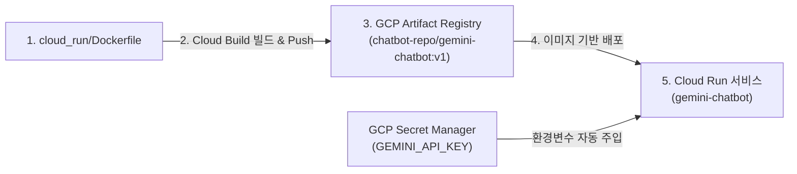

# Google Cloud Run 챗봇 배포 패키지

Google Cloud의 완전 관리형 서버리스 컨테이너 플랫폼인 **Cloud Run** 환경에 최적화된 Gemini 3.8 / 3.7 Flash 웹 챗봇 서비스입니다.

---

## 🌟 Cloud Run 배포의 주요 장점

| 구분 | Compute Engine (기존 VM) | Cloud Run (서버리스) |
| :--- | :--- | :--- |
| **비용 구조** | 사용 여부와 무관하게 24시간 과금 (월 ~$25) | **요청 처리 중에만 초 단위 과금 (미접속 시 $0)** |
| **무료 할당량** | 상시 무료 VM 스펙 제한적 | **매월 200만 건 요청 무료, 36만 GB-초 무료** |
| **SSL/HTTPS** | Let's Encrypt / Nginx 직접 세팅 필요 | **구글 관리형 글로벌 HTTPS 인증서 자동 제공** |
| **도메인** | IP 매핑(`sslip.io`) 필요 | **`*.run.app` 정식 보안 도메인 즉시 발급** |
| **오토스케일링** | 수동 인스턴스 그룹 구성 필요 | **0개부터 자동 확장 (트래픽에 따라 자동 조절)** |
| **인프라 관리** | OS 보안 패치 및 패키지 관리 필요 | **완전 관리형(Serverless)으로 인프라 관리 불필요** |

---

## 📁 디렉토리 구성

```
cloud_run/
├── app/
│   ├── static/                  # 반응형 웹 챗봇 UI (HTML, CSS, JS, SVG)
│   │   ├── css/style.css        # Gemini 공식 테마 및 반응형 디자인
│   │   ├── js/app.js            # 실시간 SSE 스트리밍, 음성인식, 마크다운 렌더링
│   │   ├── gemini-icon.svg      # 공식 Gemini SVG 아이콘
│   │   └── index.html           # 메인 챗봇 인터페이스
│   ├── __init__.py
│   ├── config.py                # Cloud Run 환경변수 우선 로드 및 Secret Manager 연동
│   └── gemini_client.py         # 실시간 SSE 스트리밍 & 웹 검색(Grounding) 클라이언트
├── main.py                      # FastAPI 웹 서버 (PORT: 8080 동적 환경변수 바인딩)
├── requirements.txt             # 경량 서버리스 의존성 패키지 목록
├── Dockerfile                   # Cloud Run 경량 컨테이너 이미지 빌드 정의 (python:3.11-slim)
├── .dockerignore                # 빌드 제외 파일 설정
├── deploy.sh                    # gcloud CLI 원클릭 배포 스크립트
├── run.bat                      # 로컬 PC 즉시 실행 스크립트 (포트 8080)
└── README.md                    # 본 안내서
```

---

## 🛠️ 컨테이너 빌드 & Cloud Run 배포 5단계 실전 작업 내역

본 프로젝트는 **"Dockerfile 빌드 ➔ GCP Artifact Registry 등록 ➔ 레지스트리 이미지를 Cloud Run으로 배포"**하는 표준 DevOps 파이프라인으로 구축되었습니다.



### [Step 1] GCP Artifact Registry (도커 저장소) 생성
컨테이너 이미지를 안전하고 격리된 상태로 보관하기 위해 전용 Docker 저장소를 생성했습니다:
```bash
gcloud artifacts repositories create chatbot-repo \
    --repository-format=docker \
    --location=us-central1 \
    --description="Docker repository for Gemini Chatbot"
```
* **저장소 전체 URI**: `us-central1-docker.pkg.dev/<YOUR_PROJECT_ID>/chatbot-repo`

---

### [Step 2] Dockerfile 기반 컨테이너 이미지 빌드 (Cloud Build)
GCP **Cloud Build**를 사용하여 로컬 환경의 Docker 데몬 의존성 없이 클라우드 상에서 직접 이미지를 빌드하고 Artifact Registry로 푸시했습니다:
```bash
# cloud_run 폴더 내에서 실행
gcloud builds submit --tag us-central1-docker.pkg.dev/<YOUR_PROJECT_ID>/chatbot-repo/gemini-chatbot:v1 .
```
* **베이스 이미지**: `python:3.11-slim`
* **빌드 소요 시간**: 약 47초
* **결과 이미지 태그**: `us-central1-docker.pkg.dev/<YOUR_PROJECT_ID>/chatbot-repo/gemini-chatbot:v1`

---

### [Step 3] Artifact Registry에 등록된 이미지 검증
저장소에 푸시된 이미지의 고유 다이제스트와 용량을 확인했습니다:
```bash
gcloud artifacts docker images list us-central1-docker.pkg.dev/<YOUR_PROJECT_ID>/chatbot-repo/gemini-chatbot
```
* **태그**: `v1`
* **이미지 크기**: **88.3 MB** (Slim 이미지 기반 초경량화 적용)
* **다이제스트**: `sha256:bf0e136a69396f099da8e94e64ecd5dbcc161be26158aa6ec233af71376861c7`

---

### [Step 4] Artifact Registry 이미지를 지정하여 Cloud Run 배포
레지스트리의 이미지를 명시하고, Secret Manager의 API 키를 환경변수로 연결하여 배포를 완료했습니다:
```bash
gcloud run deploy gemini-chatbot \
    --image=us-central1-docker.pkg.dev/<YOUR_PROJECT_ID>/chatbot-repo/gemini-chatbot:v1 \
    --region=us-central1 \
    --platform=managed \
    --allow-unauthenticated \
    --min-instances=0 \
    --max-instances=3 \
    --memory=512Mi \
    --cpu=1 \
    --set-secrets=GEMINI_API_KEY=GEMINI_API_KEY:latest
```
* **비용 최적화 (`--min-instances=0`)**: 대기 중에는 인스턴스 0대를 유지하여 **비용 $0** 보장
* **보안 비밀 주입 (`--set-secrets`)**: 소스코드 수정 없이 Secret Manager의 최신 키 값을 컨테이너에 안전하게 주입

---

### [Step 5] 라이브 서비스 검증 결과

* **배포된 서비스 URL**: `https://gemini-chatbot-<YOUR_PROJECT_NUMBER>.us-central1.run.app`
* **엔드포인트 검증**:
  1. **헬스체크 (`GET /api/health`)**: `HTTP 200 OK`
     ```json
     {"status": "ok", "service": "cloud-run", "api_key_configured": true, "default_model": "gemini-3.8-flash"}
     ```
  2. **정적 웹 인터페이스 (`GET /`)**: `HTTP 200 OK` (반응형 챗봇 UI 서빙)
  3. **실시간 대화 스트리밍 (`POST /api/chat`)**: `HTTP 200 OK` (Gemini 3.8 Flash 모델 정상 응답 및 SSE 실시간 스트리밍 출력 확인)

---

## 💻 로컬 테스트 실행 방법

Windows 로컬 PC 환경에서도 Cloud Run과 동일한 환경(포트 8080)으로 즉시 실행할 수 있습니다:

```bash
# Windows 탐색기에서 run.bat 더블클릭 또는 터미널 실행:
cd cloud_run
run.bat
```
브라우저에서 `http://localhost:8080`으로 접속하여 테스트합니다.

---

## 🔐 보안 및 Secret Manager 연동 구조

Cloud Run에서는 보안을 위해 API 키를 직접 코드에 하드코딩하지 않으며, 아래의 우선순위로 키를 바인딩합니다:
1. **Cloud Run 주입 환경변수 (1순위)**: `--set-secrets GEMINI_API_KEY=GEMINI_API_KEY:latest`로 전달된 환경변수
2. **Secret Manager API 직접 호출 (2순위 Fallback)**: 서비스 계정 IAM 권한(`roles/secretmanager.secretAccessor`)을 통한 동적 조회
3. **로컬 개발 환경 (3순위)**: `.env` 파일 (Git 커밋 제외 처리)
