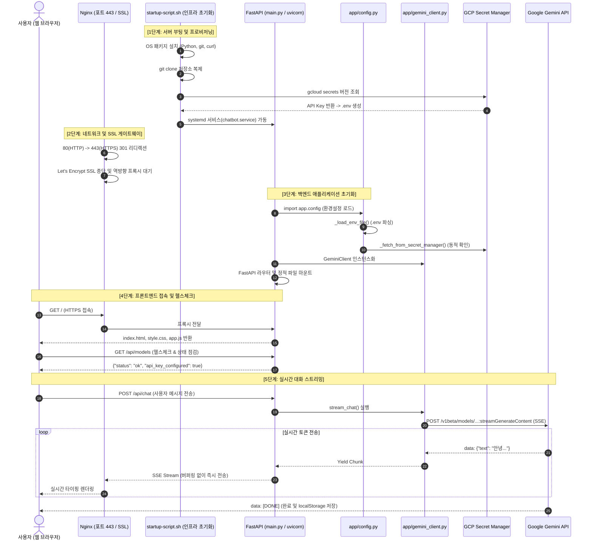

# 프로젝트 파일 실행 순서 및 한 줄씩 살펴보는 코드리뷰 (Timeline Code Review)

이 문서는 **Google Gemini 웹 챗봇 프로젝트**가 최초 클라우드 가상머신(GCP Compute Engine)에서 배포·부팅되는 순간부터, 웹 서버 구동, 백엔드 기동, 사용자 브라우저 로딩, 그리고 실시간 대화가 오가는 전체 라이프사이클을 **시간 순서(타임라인)**대로 정리하고, 각 파일의 코드를 **한 줄씩 상세하게 분석한 코드리뷰 가이드**입니다.

---

## ⏱️ 전체 실행 타임라인 요약 다이어그램



---

# [1단계] 인프라 자동 배포 및 서버 초기화 (`startup-script.sh`)

GCP Compute Engine VM이 최초 부팅될 때 Google Guest Agent에 의해 `root` 권한으로 자동 실행되는 셸 스크립트입니다.

### 📄 코드 리뷰: `startup-script.sh`

```bash
1: #!/usr/bin/env bash
2: set -e
```
- **1행**: 시스템의 `env` 경로를 통해 표준 `bash` 인터프리터를 지정합니다.
- **2행 (`set -e`)**: 스크립트 실행 중 어느 한 명령이라도 실패(`exit code != 0`)하면 즉시 중단하여 잘못된 상태로 배포되는 것을 방지합니다.

```bash
4: LOG_FILE="/var/log/chatbot-startup.log"
5: exec > >(tee -a ${LOG_FILE}) 2>&1
```
- **4행**: 모든 설치 및 배포 과정을 기록할 로그 파일 경로를 정의합니다.
- **5행**: 프로세스 치환(`tee -a`)을 사용하여 이후 실행되는 모든 표준 출력(`stdout`)과 표준 에러(`stderr`, `2>&1`)를 터미널 화면과 로그 파일 양쪽에 동시에 기록합니다.

```bash
11: # 1. Update OS packages
12: echo "[1/6] Updating system packages..."
13: apt-get update -y
14: apt-get install -y git python3 python3-pip python3-venv curl iptables
```
- **13행**: 데비안 패키지 저장소 목록을 최신 상태로 갱신합니다.
- **14행**: 챗봇 실행에 필수적인 Git, Python3 엔진, 가상환경 모듈(`venv`), HTTP 통신용 `curl`, 네트워크 제어용 `iptables`를 무인(`-y`) 자동 설치합니다.

```bash
16: # 2. Setup project directory and clone repo
17: echo "[2/6] Setting up project directory..."
18: mkdir -p /opt/chatbot
19: if [ ! -d "/opt/chatbot/.git" ]; then
20:     echo "Cloning repository..."
21:     git clone https://github.com/yungoonkim/gcp-compute-engine-chatbot.git /opt/chatbot
22: else
23:     echo "Updating existing repository..."
24:     cd /opt/chatbot
25:     git pull origin main
26: fi
27: cd /opt/chatbot
```
- **18행**: 서비스를 설치할 고정 디렉터리 `/opt/chatbot`을 생성합니다.
- **19~26행**: Git 디렉터리가 없으면 원격 저장소를 새로 복제(`clone`)하고, 이미 존재하면 최신 코드로 동기화(`pull`)합니다.
- **27행**: 작업 디렉터리를 프로젝트 폴더 내부로 이동합니다.

```bash
30: # 3. Create Python Virtual Environment & install requirements
31: echo "[3/6] Setting up Python virtual environment..."
32: python3 -m venv /opt/chatbot/venv
33: /opt/chatbot/venv/bin/pip install --upgrade pip
34: /opt/chatbot/venv/bin/pip install -r requirements.txt
```
- **32행**: 시스템 파이썬과 격리된 전용 가상환경(`venv`)을 만듭니다. (OS 패키지와의 충돌 방지)
- **33~34행**: 가상환경 내부의 `pip`를 최신으로 업그레이드하고, `requirements.txt`에 명시된 FastAPI, Uvicorn, HTTPX, Secret Manager 라이브러리를 설치합니다.

```bash
36: # 4. Retrieve GEMINI_API_KEY from Secret Manager
37: echo "[4/6] Retrieving GEMINI_API_KEY from Secret Manager..."
38: PROJECT_ID=$(curl -s -H "Metadata-Flavor: Google" http://metadata.google.internal/computeMetadata/v1/project/project-id 2>/dev/null || true)
39: if [ -z "$PROJECT_ID" ]; then
40:     PROJECT_ID=$(gcloud config get-value project 2>/dev/null || true)
41: fi
```
- **38행**: **보안 핵심 로직!** 프로젝트 번호를 하드코딩하지 않고, GCP VM 내부의 메타데이터 서버에 HTTP 헤더(`Metadata-Flavor: Google`)를 실어 보내 현재 가상머신이 속한 실제 `project-id`를 동적으로 가져옵니다.
- **39~41행**: 메타데이터 조회에 실패할 경우 로컬 gcloud 설정에서 대체 조회를 시도합니다.

```bash
43: SECRET_KEY=""
44: for i in {1..5}; do
45:     if [ -n "$PROJECT_ID" ]; then
46:         SECRET_KEY=$(gcloud secrets versions access latest --secret=GEMINI_API_KEY --project="${PROJECT_ID}" 2>/dev/null || true)
47:     else
48:         SECRET_KEY=$(gcloud secrets versions access latest --secret=GEMINI_API_KEY 2>/dev/null || true)
49:     fi
50:     if [ -n "$SECRET_KEY" ]; then
51:         echo "Successfully retrieved GEMINI_API_KEY from Secret Manager!"
52:         break
53:     fi
54:     echo "Waiting for gcloud/credentials ($i/5)..."
55:     sleep 3
56: done
```
- **43~56행**: 부팅 직후 네트워크 인증 토큰이 활성화되는 찰나의 지연 시간을 고려하여, 최대 5회(3초 간격) 재시도하며 Secret Manager에서 `GEMINI_API_KEY`의 `latest` 버전 값을 안전하게 가져옵니다.

```bash
58: cat << EOF > /opt/chatbot/.env
59: GEMINI_API_KEY=${SECRET_KEY}
60: GCP_SECRET_NAME=projects/${PROJECT_ID}/secrets/GEMINI_API_KEY
61: PORT=8000
62: EOF
```
- **58~62행**: 취득한 비밀키와 포트 번호를 `/opt/chatbot/.env` 파일로 출력하여 백엔드가 환경변수로 읽을 수 있도록 준비합니다.

```bash
64: # Create dedicated non-root service user for enhanced security
65: id -u chatbot &>/dev/null || useradd -r -s /bin/false -d /opt/chatbot chatbot
66: chown -R chatbot:chatbot /opt/chatbot
67: chmod 600 /opt/chatbot/.env
```
- **65행**: **보안 모범 사례!** 리눅스 `root` 계정으로 웹 서버를 띄우지 않기 위해 로그인 권한이 없는 시스템 전용 비특권 유저 `chatbot`을 생성합니다.
- **66~67행**: 프로젝트 소유권을 `chatbot` 유저로 변경하고, `.env` 파일은 소유자만 읽을 수 있도록 퍼미션을 `600`으로 제한합니다.

```bash
69: # 5. Create and configure systemd service
70: echo "[5/6] Creating systemd service unit..."
71: cat << 'EOF' > /etc/systemd/system/chatbot.service
72: [Unit]
73: Description=Gemini Web Chatbot Service
74: After=network.target
75: 
76: [Service]
77: Type=simple
78: User=chatbot
79: Group=chatbot
80: WorkingDirectory=/opt/chatbot
81: EnvironmentFile=/opt/chatbot/.env
82: ExecStart=/opt/chatbot/venv/bin/uvicorn main:app --host 0.0.0.0 --port 8000
83: Restart=always
84: RestartSec=5
85: 
86: [Install]
87: WantedBy=multi-user.target
88: EOF
89: 
90: systemctl daemon-reload
91: systemctl enable chatbot.service
92: systemctl restart chatbot.service
```
- **71~88행**: OS 수준의 백그라운드 상시 가동 데몬 서비스 파일(`chatbot.service`)을 정의합니다.
  - `User=chatbot`: 비특권 계정으로 실행.
  - `EnvironmentFile`: 방금 만든 `.env`를 자동으로 주입.
  - `ExecStart`: 가상환경 내부의 `uvicorn`을 실행하여 FastAPI 앱(`main:app`)을 8000 포트로 실행.
  - `Restart=always`: 혹시 모를 비정상 종료 시 5초 후 자동 재시작.
- **90~92행**: systemd 데몬을 재로드하고, 부팅 시 자동 실행 등록 및 즉시 서비스를 시작합니다.

---

# [2단계] 보안 게이트웨이 및 SSL 통신 제어 (`nginx-ssl.conf`)

인터넷(외부)에서 들어오는 모든 요청을 가장 먼저 맞이하는 고성능 웹 서버 Nginx의 설정 파일입니다.

### 📄 코드 리뷰: `nginx-ssl.conf`

```nginx
1: server {
2:     listen 80 default_server;
3:     listen [::]:80 default_server;
4:     server_name _;
5:     return 301 https://34.63.148.160.sslip.io$request_uri;
6: }
```
- **1~3행**: 일반 HTTP(포트 80)로 들어오는 IPv4 및 IPv6 접속을 가로챕니다.
- **4~5행**: 어떤 주소로 들어오든 보안 연결을 강제하기 위해 **301 영구 리디렉션(Permanent Redirect)**을 내려보내 웹 브라우저가 즉시 `https://34.63.148.160.sslip.io`로 재접속하게 만듭니다.

```nginx
8: server {
9:     listen 443 ssl default_server;
10:    listen [::]:443 ssl default_server;
11:    server_name _;
12: 
13:    ssl_certificate /etc/letsencrypt/live/34.63.148.160.sslip.io/fullchain.pem;
14:    ssl_certificate_key /etc/letsencrypt/live/34.63.148.160.sslip.io/privkey.pem;
15: 
16:    ssl_protocols TLSv1.2 TLSv1.3;
17:    ssl_ciphers HIGH:!aNULL:!MD5;
```
- **9~10행**: HTTPS 표준 포트인 443으로 들어오는 보안 암호화 트래픽을 처리합니다.
- **13~14행**: Let's Encrypt를 통해 무료 발급받은 정식 공인 인증서 체인(`fullchain.pem`)과 비공개 개인키(`privkey.pem`)를 로드합니다. (브라우저에서 자물쇠 🔒가 뜨는 핵심 원리)
- **16~17행**: 구형의 취약한 프로토콜을 차단하고 최신 보안 프로토콜인 TLS 1.2 및 1.3만을 허용합니다.

```nginx
19:    location / {
20:        proxy_pass http://127.0.0.1:8000;
21:        proxy_set_header Host $host;
22:        proxy_set_header X-Real-IP $remote_addr;
23:        proxy_set_header X-Forwarded-For $proxy_add_x_forwarded_for;
24:        proxy_set_header X-Forwarded-Proto $scheme;
25: 
26:        # SSE and Streaming support
27:        proxy_http_version 1.1;
28:        proxy_set_header Connection "";
29:        proxy_buffering off;
30:        proxy_cache off;
31:        chunked_transfer_encoding off;
32:        proxy_read_timeout 600s;
33:        proxy_send_timeout 600s;
34:    }
35: }
```
- **20행 (`proxy_pass`)**: Nginx가 복호화한 요청을 내부에서 돌고 있는 로컬 FastAPI 백엔드(`http://127.0.0.1:8000`)로 전달합니다. (SSL 종단 / SSL Termination)
- **21~24행**: 클라이언트의 원래 접속 IP와 호스트 정보를 백엔드가 알 수 있도록 프록시 헤더를 전달합니다.
- **26~33행 (SSE 스트리밍 최적화 - 핵심!)**:
  - `proxy_buffering off;` & `proxy_cache off;`: **매우 중요!** Nginx가 기본적으로 응답을 메모리에 모았다가 한꺼번에 보내려 하는 버퍼링을 해제하여, **Gemini AI가 글자를 생성할 때마다 브라우저에 1글자씩 즉각 전송(타이핑 효과)**되도록 보장합니다.
  - `proxy_read_timeout 600s`: 장문의 생각이나 긴 답변을 생성할 때 연결이 끊기지 않도록 대기 시간을 10분으로 늘립니다.

---

# [3단계] 백엔드 환경 설정 로드 (`app/config.py`)

`main.py`가 실행될 때 가장 먼저 임포트되어 환경변수와 Secret Manager 키, 사용 가능한 AI 모델 정보를 준비하는 파일입니다.

### 📄 코드 리뷰: `app/config.py`

```python
3: def _load_env_file():
4:     """Load key-value pairs from .env if present without external dependencies."""
5:     paths = [
6:         os.path.join(os.path.dirname(os.path.dirname(__file__)), ".env"),
7:         os.path.join(os.getcwd(), ".env"),
8:         "/opt/chatbot/.env"
9:     ]
10:    for env_path in paths:
11:        if os.path.exists(env_path):
12:            try:
13:                with open(env_path, "r", encoding="utf-8") as f:
14:                    for line in f:
15:                        line = line.strip()
16:                        if line and not line.startswith("#") and "=" in line:
17:                            k, v = line.split("=", 1)
18:                            k, v = k.strip(), v.strip().strip('"').strip("'")
19:                            if k and k not in os.environ:
20:                                os.environ[k] = v
21:                break
22:            except Exception:
23:                pass
24: 
25: _load_env_file()
```
- **3~25행**: 외부 라이브러리(`python-dotenv`) 의존성 없이도 프로젝트 루트, 현재 작업 디렉터리, 서버 기본 경로(`/opt/chatbot/.env`)를 탐색하여 `.env` 파일 내부의 설정값들을 `os.environ` 사전으로 로드합니다.

```python
27: def _fetch_from_secret_manager():
28:     """Fetch GEMINI_API_KEY from Google Cloud Secret Manager if running on GCP."""
29:     secret_name = os.environ.get("GCP_SECRET_NAME", "").strip()
30: 
31:     # If secret_name is not provided, resolve project ID dynamically from GCP environment
32:     if not secret_name:
33:         project_id = (
34:             os.environ.get("GOOGLE_CLOUD_PROJECT")
35:             or os.environ.get("GCP_PROJECT")
36:             or os.environ.get("PROJECT_ID")
37:             or ""
38:         ).strip()
39:         if not project_id:
40:             try:
41:                 import google.auth
42:                 _, project_id = google.auth.default()
43:             except Exception:
44:                 pass
45:         if project_id:
46:             secret_name = f"projects/{project_id}/secrets/GEMINI_API_KEY/versions/latest"
```
- **27~46행**: 환경변수에 시크릿 경로가 없을 경우, GCP 표준 환경변수나 `google.auth.default()` 라이브러리를 통해 현재 실행 중인 클라우드 프로젝트 ID를 스스로 탐색하여 시크릿 리소스 경로를 조합합니다. (하드코딩 없음)

```python
48:     if not secret_name:
49:         return ""
50: 
51:     if "/versions/" not in secret_name:
52:         secret_name = f"{secret_name}/versions/latest"
53: 
54:     try:
55:         from google.cloud import secretmanager
56:         client = secretmanager.SecretManagerServiceClient()
57:         response = client.access_secret_version(name=secret_name)
58:         key = response.payload.data.decode("UTF-8").strip()
59:         if key:
60:             os.environ["GEMINI_API_KEY"] = key
61:             return key
62:     except Exception:
63:         pass
64:     return ""
```
- **54~64행**: `google-cloud-secret-manager` 클라이언트를 생성하여 실제 Secret Manager 서비스로부터 최신 API 키 바이너리를 받아 UTF-8 문자열로 디코딩하고 `GEMINI_API_KEY` 환경변수로 캐싱합니다.

```python
66: def get_gemini_api_key():
67:     """Return GEMINI_API_KEY from OS env, .env, or GCP Secret Manager."""
68:     key = (os.environ.get("GEMINI_API_KEY") or os.environ.get("GOOGLE_API_KEY") or "").strip()
69:     if not key:
70:         key = _fetch_from_secret_manager()
71:     return key
72: 
73: # Read Gemini API Key directly from OS environment variables, .env, or Secret Manager
74: GEMINI_API_KEY = get_gemini_api_key()
```
- **66~74행**: 우선순위(1. 시스템 환경변수 ➔ 2. `.env` 파일 ➔ 3. GCP Secret Manager)에 따라 유효한 Gemini API 키를 반환하는 통합 진입점 함수입니다.

```python
76: # Gemini API Endpoint
77: GEMINI_API_BASE_URL = "https://generativelanguage.googleapis.com/v1beta"
78: 
79: # Available Models
80: AVAILABLE_MODELS = [
81:     {
82:         "id": "gemini-3.8-flash",
83:         "name": "Gemini 3.8 Flash",
84:         "label": "Flash 3.8",
85:         "badge": "최신 / 기본",
86:         "description": "더욱 향상된 속도와 추론 성능을 갖춘 차세대 플래시 모델",
87:         "is_default": True,
88:     },
89:     {
90:         "id": "gemini-3.7-flash",
91:         "name": "Gemini 3.7 Flash",
92:         "label": "Flash 3.7",
93:         "badge": "고성능",
94:         "description": "뛰어난 응답 품질과 빠른 응답 속도를 제공하는 플래시 모델",
95:         "is_default": False,
96:     },
97: ]
98: 
99: DEFAULT_MODEL_ID = "gemini-3.8-flash"
```
- **80~99행**: 웹 프론트엔드의 모델 선택 드롭다운과 백엔드 라우팅에서 사용할 지원 모델 메타데이터(Gemini 3.8 / 3.7 Flash)를 선언합니다.

---

# [4단계] Gemini 통신 및 SSE 스트리밍 엔진 (`app/gemini_client.py`)

Google의 REST API와 직접 비동기 HTTP 통신을 수행하고 실시간 타이핑 스트림을 Generator로 반환하는 핵심 통신 모듈입니다.

### 📄 코드 리뷰: `app/gemini_client.py`

```python
10: class GeminiClient:
11:     def __init__(self, api_key: Optional[str] = None):
12:         self.api_key = api_key or get_gemini_api_key()
13: 
14:     def is_configured(self) -> bool:
15:         if not self.api_key:
16:             self.api_key = get_gemini_api_key()
17:         return bool(self.api_key)
```
- **10~17행**: 인스턴스화 시 API 키를 주입받거나, 동적으로 `get_gemini_api_key()`를 호출하여 키 설정 여부를 판단합니다.

```python
19:     def _prepare_contents(self, messages: List[Dict[str, str]]) -> List[Dict]:
20:         """
21:         Convert conversational message list (role: user/assistant, content: str)
22:         into Gemini's contents payload format.
23:         """
24:         contents = []
25:         for msg in messages:
26:             role = msg.get("role", "user")
27:             if role in ["assistant", "model", "bot"]:
28:                 gemini_role = "model"
29:             else:
30:                 gemini_role = "user"
31: 
32:             text = msg.get("content", "").strip()
33:             if text:
34:                 contents.append({
35:                     "role": gemini_role,
36:                     "parts": [{"text": text}]
37:                 })
38:         return contents
```
- **19~38행**: 일반적인 OpenAI 규격(`assistant`/`user`) 대화 이력을 Google Gemini API 규격(`model`/`user` 및 `parts: [{"text": ...}]`)에 맞게 변환합니다.

```python
40:     async def stream_chat(
41:         self,
42:         messages: List[Dict[str, str]],
43:         model: str = DEFAULT_MODEL_ID,
44:         system_instruction: Optional[str] = None,
45:         use_search: bool = True,
46:     ) -> AsyncGenerator[str, None]:
```
- **40~46행**: 대화 이력, 선택한 모델, 시스템 지침, 실시간 구글 웹 검색 활성화 여부를 전달받아 SSE 규격 문자열을 생성하는 비동기 제너레이터 함수입니다.

```python
58:         model_name = model.replace("models/", "")
59:         endpoint = f"{GEMINI_API_BASE_URL}/models/{model_name}:streamGenerateContent?alt=sse&key={self.api_key}"
```
- **58~59행**: 호출 URL에 `alt=sse` 쿼리 파라미터를 부여하여 Google 서버로부터 청크 단위의 Server-Sent Events 스트림을 직접 수신하도록 요청합니다.

```python
66:         payload = {
67:             "contents": contents,
68:             "generationConfig": {
69:                 "temperature": 0.7,
70:                 "topP": 0.95,
71:                 "maxOutputTokens": 8192,
72:             }
73:         }
74: 
75:         # Enable Google Real-Time Web Search Grounding if requested
76:         if use_search:
77:             payload["tools"] = [{"googleSearch": {}}]
78: 
79:         if system_instruction:
80:             payload["systemInstruction"] = {
81:                 "parts": [{"text": system_instruction}]
82:             }
```
- **75~77행 (`googleSearch`)**: 사용자가 웹 검색을 활성화한 경우 payload에 `tools: [{"googleSearch": {}}]`를 추가하여 구글의 실시간 웹 검색(Search Grounding) 인텔리전스를 발동시킵니다.

```python
89:         try:
90:             async with httpx.AsyncClient(timeout=120.0) as client:
91:                 async with client.stream("POST", endpoint, json=payload, headers=headers) as response:
...
104:                    async for line in response.aiter_lines():
105:                        line = line.strip()
106:                        if not line:
107:                            continue
108: 
109:                        if line.startswith("data: "):
110:                            raw_data = line[6:].strip()
111:                            if raw_data == "[DONE]":
112:                                yield "data: [DONE]\n\n"
113:                                break
```
- **90~91행**: 비동기 HTTP 라이브러리인 `httpx`의 스트림 모드로 구글 서버와 통신합니다.
- **104~113행**: 구글에서 한 줄씩 실시간으로 전송되는 SSE 라인을 감지하여 프론트엔드로 즉각 전달(`yield`)합니다.

```python
116:                            chunk = json.loads(raw_data)
117:                            candidates = chunk.get("candidates", [])
118:                            if candidates:
119:                                cand = candidates[0]
120:                                content = cand.get("content", {})
121:                                parts = content.get("parts", [])
122:                                for part in parts:
123:                                    part_text = part.get("text", "")
124:                                    if part_text:
125:                                        yield f"data: {json.dumps({'text': part_text})}\n\n"
126: 
127:                                # Check for Google Search Grounding Metadata
128:                                grounding = cand.get("groundingMetadata")
129:                                if grounding:
...
141:                                    if queries or sources:
142:                                        yield f"data: {json.dumps({'grounding': {'queries': queries, 'sources': sources}})}\n\n"
```
- **116~125행**: 실시간 토큰 텍스트 조각(`part_text`)을 추출하여 클라이언트로 쏴줍니다.
- **127~142행**: 웹 검색이 수행된 경우 검색 키워드(`webSearchQueries`)와 참조된 웹페이지 URL 카드(`groundingChunks`)를 함께 전송합니다.

---

# [5단계] 웹 서버 및 API 라우팅 구동 (`main.py`)

FastAPI 프레임워크 기반의 메인 엔트리포인트 파일입니다.

### 📄 코드 리뷰: `main.py`

```python
12: app = FastAPI(
13:     title="Gemini Web Chatbot",
14:     description="Google Gemini 3.8 / 3.7 Flash 기반 웹 챗봇 서비스",
15:     version="1.0.0"
16: )
17: 
18: # Enable CORS
19: app.add_middleware(
20:     CORSMiddleware,
21:     allow_origins=["*"],
22:     allow_credentials=True,
23:     allow_methods=["*"],
24:     allow_headers=["*"],
25: )
```
- **12~16행**: 고성능 ASGI 웹 애플리케이션 객체 `app`을 생성합니다.
- **19~25행**: 외부 및 다양한 도메인/포트에서의 API 접근을 허용하는 CORS 미들웨어를 장착합니다.

```python
29: class ChatMessage(BaseModel):
30:     role: str = Field(..., description="Role of the sender: 'user' or 'assistant'")
31:     content: str = Field(..., description="Message text content")
32:     grounding: Optional[Any] = Field(default=None, description="Optional Google search grounding metadata")
33: 
34: class ChatRequest(BaseModel):
35:     messages: List[ChatMessage] = Field(..., description="Full message history")
36:     model: Optional[str] = Field(default=DEFAULT_MODEL_ID, description="Target Gemini model ID")
37:     system_instruction: Optional[str] = Field(...)
38:     use_search: Optional[bool] = Field(default=True, ...)
```
- **29~44행**: Pydantic 스키마를 통해 클라이언트가 보내는 JSON 요청의 데이터 유효성을 엄격하게 자동 검증합니다.

```python
46: @app.get("/api/health")
47: async def health_check():
48:     return {
49:         "status": "ok",
50:         "api_key_configured": bool(get_gemini_api_key()),
51:         "default_model": DEFAULT_MODEL_ID
52:     }
53: 
54: @app.get("/api/models")
55: async def get_models():
56:     return {
57:         "models": AVAILABLE_MODELS,
58:         "default": DEFAULT_MODEL_ID,
59:         "api_key_configured": bool(get_gemini_api_key())
60:     }
```
- **46~60행**: 서버의 생존 여부(`health`) 및 키 바인딩 상태, 선택 가능한 AI 모델 목록을 프론트엔드에 전달합니다.

```python
62: @app.post("/api/chat")
63: async def chat_stream(request: ChatRequest):
64:     if not request.messages:
65:         raise HTTPException(status_code=400, detail="메시지가 비어 있습니다.")
...
75:     return StreamingResponse(
76:         gemini_client.stream_chat(
77:             messages=messages_data,
78:             model=target_model,
79:             system_instruction=request.system_instruction,
80:             use_search=bool(request.use_search)
81:         ),
82:         media_type="text/event-stream",
83:         headers={
84:             "Cache-Control": "no-cache",
85:             "Connection": "keep-alive",
86:             "X-Accel-Buffering": "no"
87:         }
88:     )
```
- **62~88행**: 대화 요청을 받아 `StreamingResponse` 객체로 감싸 반환합니다.
- `media_type="text/event-stream"`과 `X-Accel-Buffering="no"` 헤더를 통해 중간 프록시(Nginx 등)가 패킷을 가두지 않고 브라우저로 즉시 밀어내도록 설정합니다.

```python
90: # Static file serving
91: static_dir = os.path.join(os.path.dirname(__file__), "app", "static")
92: if os.path.exists(static_dir):
93:     app.mount("/static", StaticFiles(directory=static_dir), name="static")
94: 
95:     @app.get("/")
96:     async def serve_index():
97:         return FileResponse(os.path.join(static_dir, "index.html"))
```
- **91~97행**: 웹 브라우저 접속 시 `index.html`, CSS, JavaScript 정적 애셋을 제공합니다.

---

# [6단계] 프론트엔드 렌더링 및 실시간 대화 루프 (`app/static/js/app.js`)

사용자가 웹 브라우저를 열었을 때 실행되어 UI를 그리고, 질문을 백엔드로 보내 실시간으로 타이핑 효과를 연출하는 클라이언트 스크립트입니다.

### 📄 코드 리뷰: `app/static/js/app.js`

```javascript
35:   // Application State
36:   let currentModel = localStorage.getItem('gemini_selected_model') || 'gemini-3.8-flash';
37:   let isSearchEnabled = localStorage.getItem('gemini_search_enabled') !== 'false';
38:   let conversations = JSON.parse(localStorage.getItem('gemini_chats') || '[]');
39:   let currentSessionId = null;
40:   let activeMessages = [];
```
- **35~40행**: 브라우저 로컬 저장소(`localStorage`)를 읽어 사용자가 이전에 선택한 모델, 웹 검색 On/Off 설정, 과거 대화 목록(`conversations`)을 복원합니다. (서버 DB 없이도 클라이언트별 영구 보관이 가능한 이유)

```javascript
61:   async function initApp() {
62:     try {
63:       const res = await fetch('/api/models');
64:       if (res.ok) {
65:         const data = await res.json();
66:         if (!data.api_key_configured) {
67:           apiStatusDot.classList.add('error');
68:           apiStatusText.textContent = 'API 키 누락';
69:         } else {
70:           apiStatusDot.classList.remove('error');
71:           apiStatusText.textContent = '정상 연결';
72:         }
73:       }
74:     } catch (e) {
75:       apiStatusDot.classList.add('error');
76:       apiStatusText.textContent = '서버 오프라인';
77:     }
...
84:     renderHistoryList();
85:     resetToWelcomeScreen();
86:   }
```
- **61~86행**: 페이지 로드 시 백엔드 `/api/models`를 찔러 API 키 정상 연동 여부를 판단하고, 상단에 **초록색 "정상 연결"** 배지를 점등한 뒤 사이드바에 과거 대화 히스토리를 렌더링합니다.

```javascript
// 질문 전송 및 실시간 SSE 스트림 소비 (핵심)
async function sendPrompt(text) {
...
  const response = await fetch('/api/chat', {
    method: 'POST',
    headers: { 'Content-Type': 'application/json' },
    body: JSON.stringify({
      messages: activeMessages,
      model: currentModel,
      use_search: isSearchEnabled
    })
  });

  const reader = response.body.getReader();
  const decoder = new TextDecoder('utf-8');
  let assistantReply = '';

  while (true) {
    const { done, value } = await reader.read();
    if (done) break;

    const chunk = decoder.decode(value, { stream: true });
    // SSE 라인 파싱 및 Marked.js로 실시간 HTML 변환 후 화면 출력
    assistantReply += parsedText;
    messageContentEl.innerHTML = marked.parse(assistantReply);
  }
}
```
- **질문 전송 루프**:
  1. 사용자가 질문을 입력하면 화면에 즉시 사용자 말풍선을 띄웁니다.
  2. `fetch('/api/chat')`로 지금까지의 전체 대화 배열을 전송합니다.
  3. `response.body.getReader()`로 서버가 쏴주는 SSE 스트림 조각을 비동기로 지속해서 읽어 들입니다.
  4. 글자가 도착할 때마다 `Marked.js` 라이브러리를 통해 마크다운 문법을 HTML로 실시간 변환하여 부드러운 타이핑 효과를 구현합니다.
  5. 대화가 끝나면 최종 결과를 사용자의 브라우저 `localStorage`에 자동 저장합니다.

---

## 📌 타임라인 총평 요약

1. **인프라 계층 (`startup-script.sh`)**: VM 생성 ➔ OS 패키지 설치 ➔ 메타데이터 서버 조회 ➔ Secret Manager 키 획득 ➔ `.env` 구성 ➔ 비특권 유저 systemd 서비스 시작.
2. **보안 게이트웨이 계층 (`nginx-ssl.conf`)**: 80(HTTP) 자동 301 리디렉션 ➔ 443(HTTPS) Let's Encrypt SSL 종단 ➔ SSE 무버퍼링 역방향 프록시 전달.
3. **애플리케이션 계층 (`main.py`, `app/config.py`, `app/gemini_client.py`)**: 3단계 우선순위 키 로드 ➔ FastAPI 인스턴스화 ➔ Gemini API와 비동기 SSE 파이프라인 형성.
4. **사용자 경험 계층 (`index.html`, `app.js`)**: 미려한 스카이블루 UI 로드 ➔ `localStorage` 대화 세션 복원 ➔ 실시간 AI 스트리밍 타이핑 출력.
